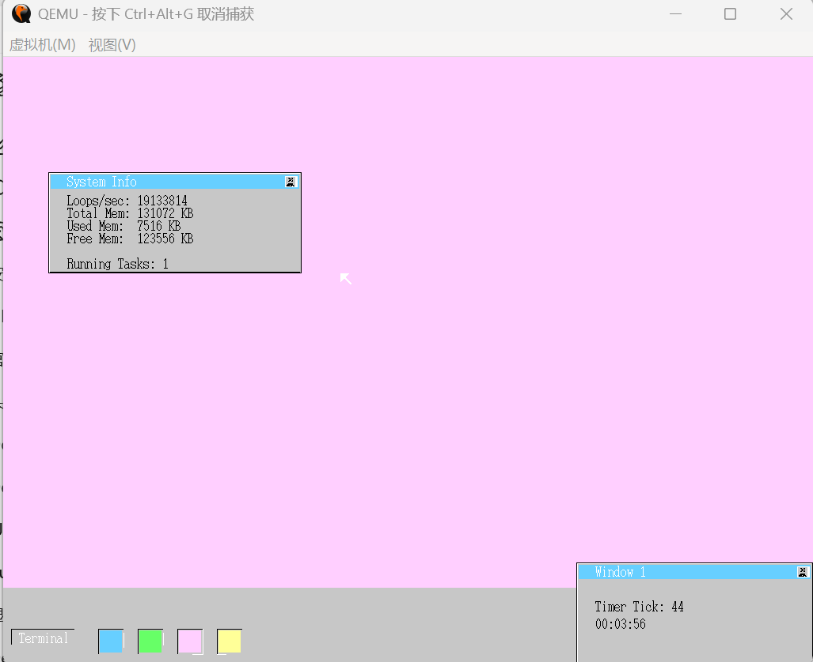
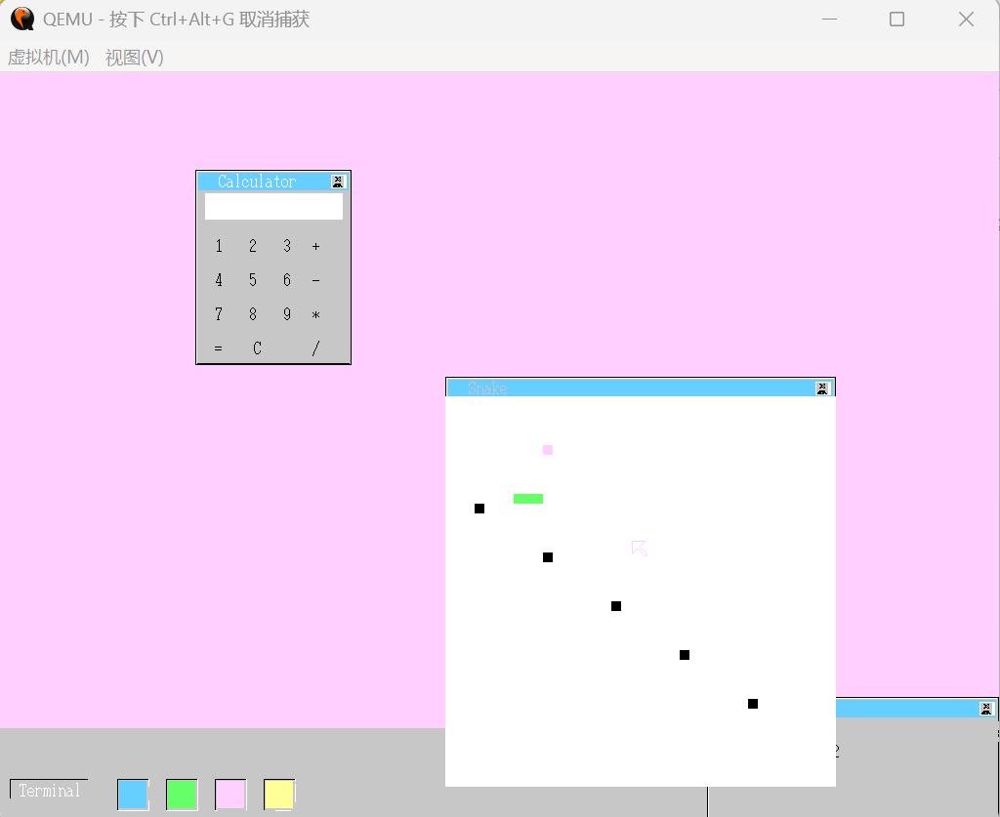
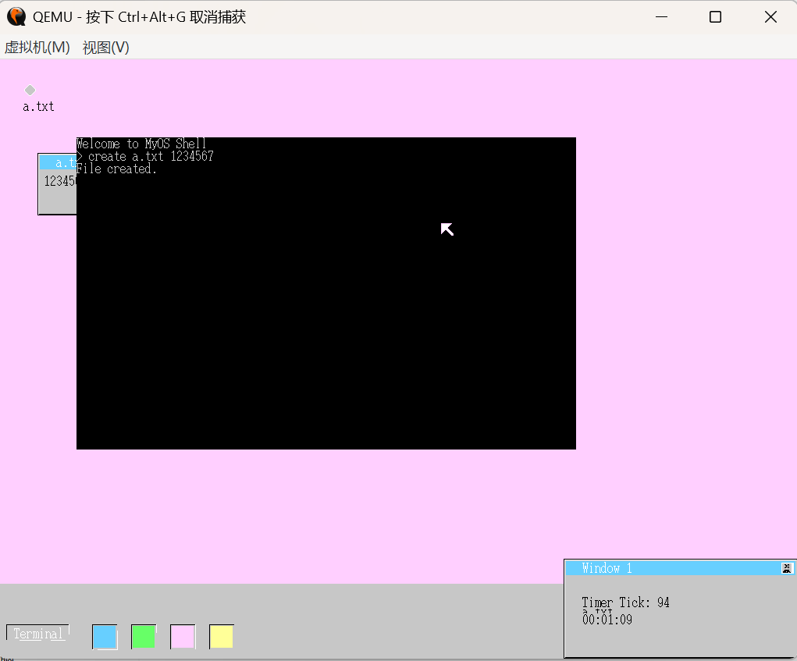

明白了，我直接给你一个完整的 `README.md` 文件内容，你可以直接复制进去使用：

````markdown
# MY_OS
TJ2025暑期操作系统课程设计项目

---

## 项目简介
MY_OS 是一个基于裸机开发的迷你操作系统，参考《30天自制操作系统》教材开发，实现了基础图形界面、多任务管理、窗口管理、鼠标与键盘交互以及简单的应用程序。  
项目主要功能包括：
- 图形化桌面和窗口管理
- 鼠标和键盘事件处理
- 任务管理与定时器支持
- 内置应用程序：
  - 终端控制台（Console）
  - 文件管理窗口
  - 计算器
  - 贪吃蛇小游戏
  - 系统信息监控窗口

---

## 运行环境
- 操作系统：Windows / Linux
- 虚拟机：QEMU（推荐）
- 镜像文件：haribote.img`（位于项目根目录）

---

## 启动方法
1. 确保已下载或 `haribote.img`。
2. 使用 QEMU 启动：
   ```bash
   qemu-system-i386 -fda haribote.img 
````

3. 系统将直接启动进入图形界面桌面。

---

## 操作方法

* **鼠标操作**

  * 左键点击窗口或任务栏图标打开应用程序
  * 拖动窗口标题栏移动窗口
  * 点击窗口右上角关闭按钮关闭窗口
* **键盘操作**

  * 打开 Console 后，可输入基本命令
* **应用程序操作示例**

  * Console：执行内置命令，如 `mem` 查看内存
  * 文件管理器：显示文件列表，可打开文件
  * 贪吃蛇：使用方向键控制蛇移动
  * 计算器：点击数字和运算符进行计算
  * 系统信息窗口

---

## 常用命令

| 命令     | 功能说明       |
| ------ | ---------- |
| `mem`  | 显示总内存和空闲内存 |
| `cls`  | 清屏         |
| `help` | 显示命令列表     |

> 其他命令可在 文档、源码中查看。

---

## 注意事项

* 请确保镜像文件完整，不要在非 x86 平台直接运行
* 鼠标键盘操作需在虚拟机窗口内进行
* 系统暂不支持多用户环境，仅演示单用户交互
* 操作系统处于实验阶段，若感觉拖拽困难，鼠标识别不到为可以尝试重新打开操作系统！

---

## 项目截图







```

